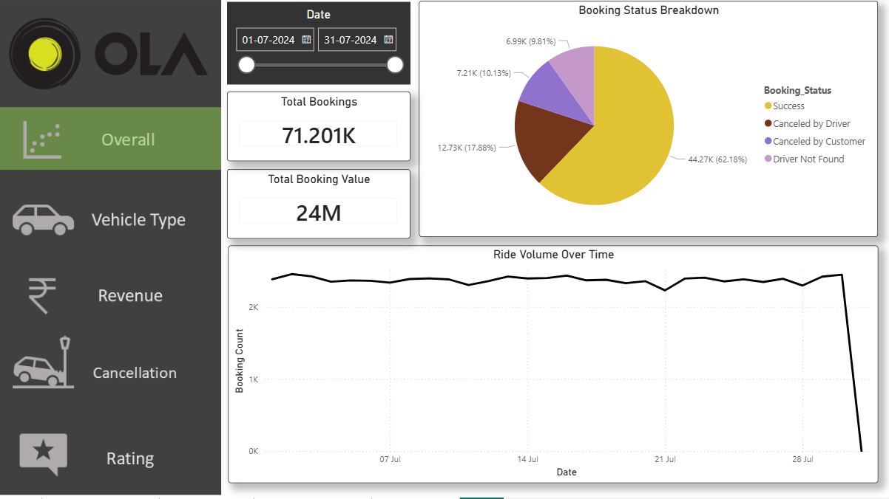
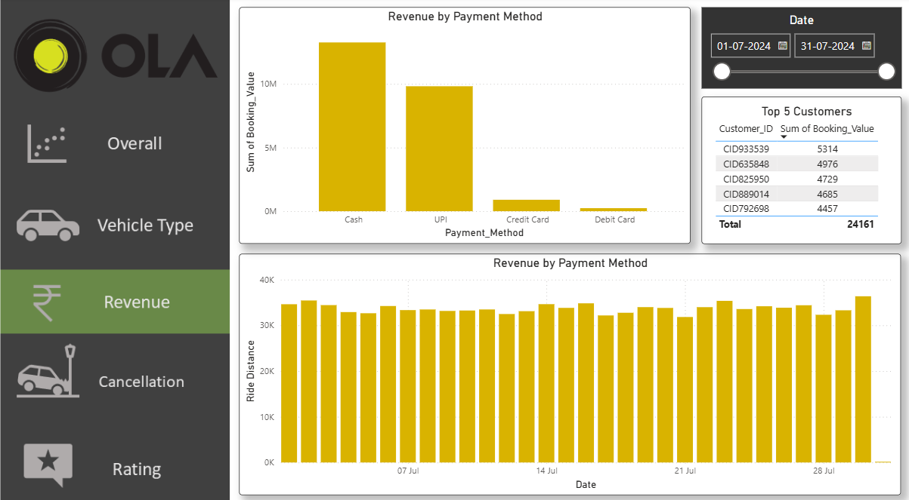
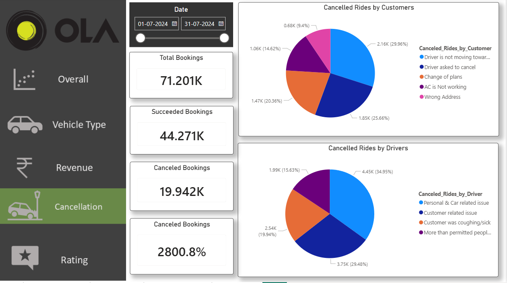
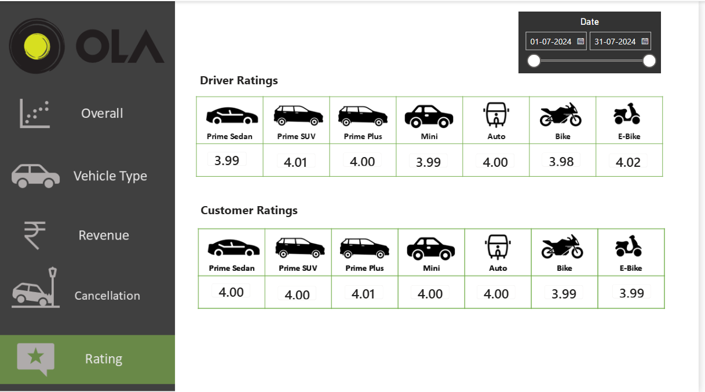

# OLA Ride Analytics Dashboard

An end-to-end data analytics project that analyzes OLA ride booking data using **Python, MySQL, Excel, and Power BI**. The project provides business insights through interactive dashboards, SQL analysis, and key performance metrics.

---

## Project Overview

This project focuses on:

* Data Cleaning & Preprocessing
* SQL Data Analysis
* Interactive Power BI Dashboard
* Business KPI Analysis
* Data-Driven Insights

---

## Tech Stack

* Python (Pandas, NumPy)
* MySQL
* Power BI
* Microsoft Excel

---

## Dashboard Preview

### Overview Dashboard



### Revenue Dashboard



### Cancellation Dashboard



### Ratings Dashboard



---

## Key Insights

* Analyzed ride booking trends and booking status.
* Identified revenue by payment method.
* Compared customer and driver ratings.
* Analyzed ride cancellation reasons.
* Evaluated vehicle performance and ride distance.

---

## Project Structure

```
ola-ride-analytics-dashboard/
├── dashboard/
├── data/
├── sql/
├── images/
└── README.md
```

---

## Author

**Suhail Khan**
